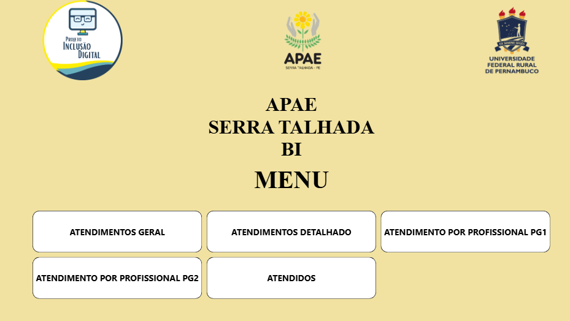
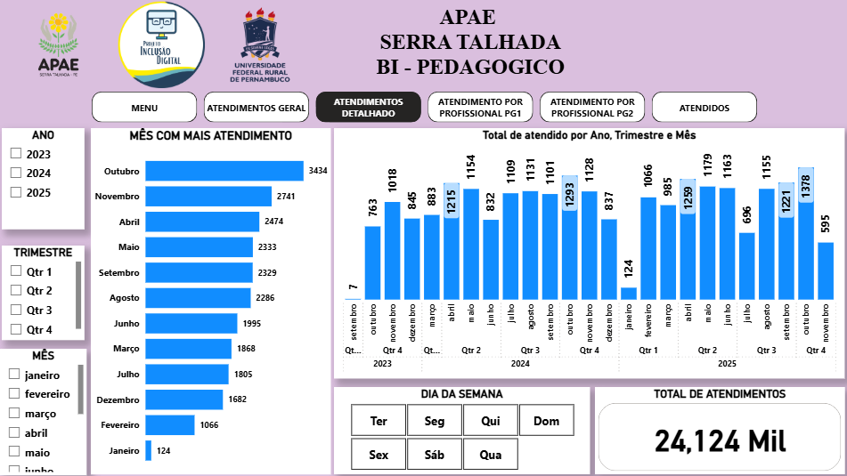
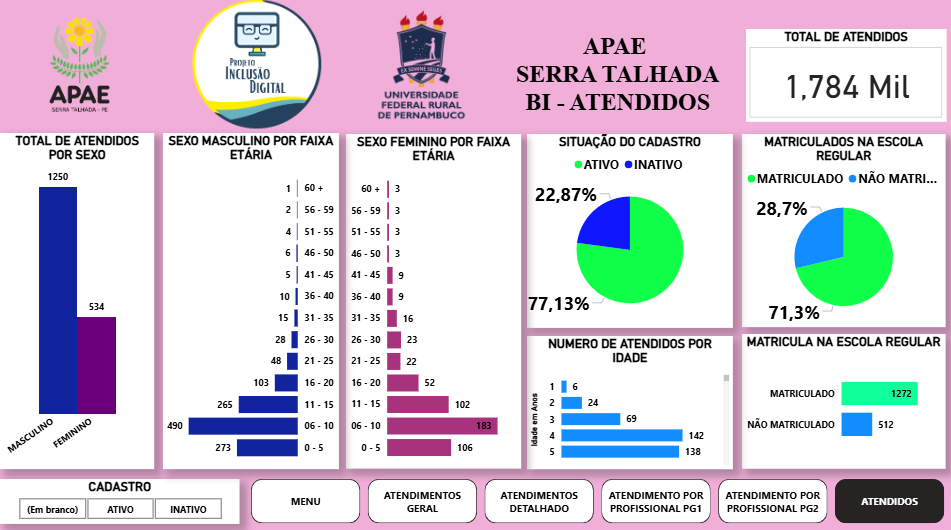

# 📊 Dashboard de Gestão Educacional - APAE Serra Talhada

## 📝 Sobre o Projeto
Este projeto foi desenvolvido para o setor de educação da APAE em Serra Talhada, como parte da disciplina de Sistemas de Apoio à Decisão (SAD). O objetivo foi transformar dados brutos de planilhas exportadas do sistema ARGOS em inteligência estratégica para a tomada de decisão pedagógica e administrativa.

## Imagens de algumas telas do Dashboard
- Tela de menu 

- Tela de atendimento por período 

- Tela do panorama sociodemográfico dos atendidos

## 🛠️ Tecnologias e Ferramentas
Pentaho Data Integration (PDI): Utilizado para o processo de ETL (Extração, Transformação e Carga).

Power BI: Criação do modelo de dados e visualização.

Linguagem DAX: Criação de medidas complexas para análise de indicadores (KPIs).

Argus: Fonte primária de dados, onde foram exportados e tranformados arquivos csv.

Armazenamento: Postgres, em dois DB um DV e outro DW

## 🚀 Desafios Solucionados
Centralização: Unificação de dados dispersos em múltiplas fontes.

Limpeza de Dados: Tratamento de inconsistências em nomes de alunos, funcionarios, datas através do Pentaho.

Indicadores de Impacto: Criação de visões sobre frequência, perfil socioeconômico dos alunos atendidos, período com maior volume de atendimento.

📈 Funcionalidades do Dashboard
Visão Geral: Panorama total atendidos ativos e atendimentos.

Análise por Profissional e Período: Identificação de gargalos ou e quantidade individual de atendidos por proficional.

Filtros Dinâmicos: Segmentação por período, status do atendido, faixa etária .

📐 Estrutura do Repositório
/capturas: Contém o arquivo .png das telas do BI e fluxo de ETL.

/projeto: contem o etl Scripts ou prints do fluxo realizado no Pentaho.

👤 Autor
Wagner Santos Estudante de Sistemas de Informação | Apaixonado por Dados e Tecnologia.
